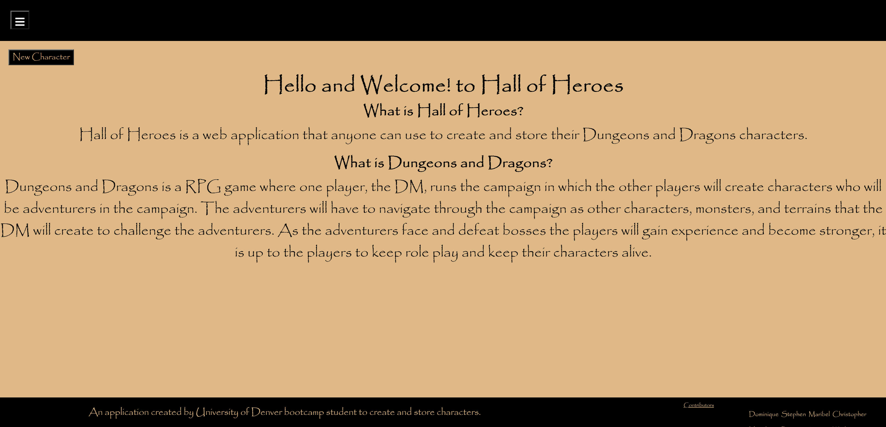
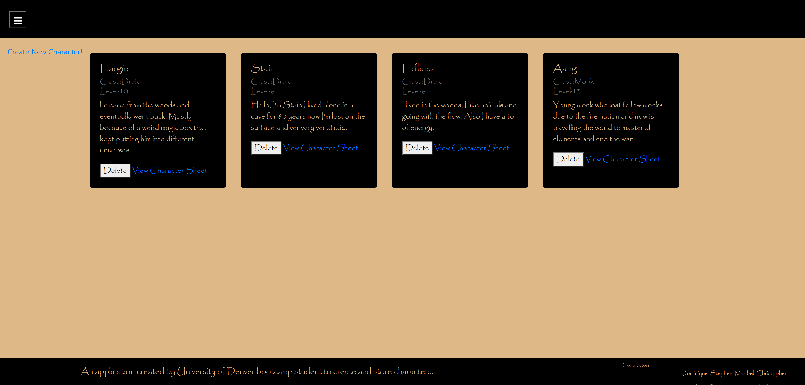
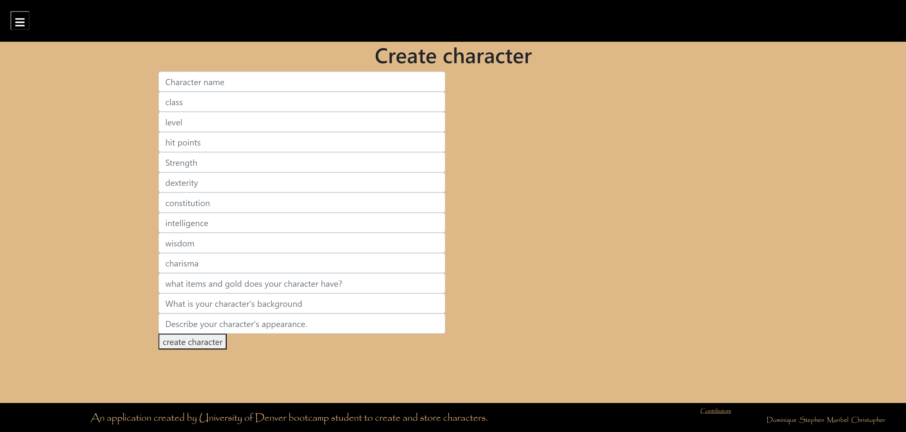
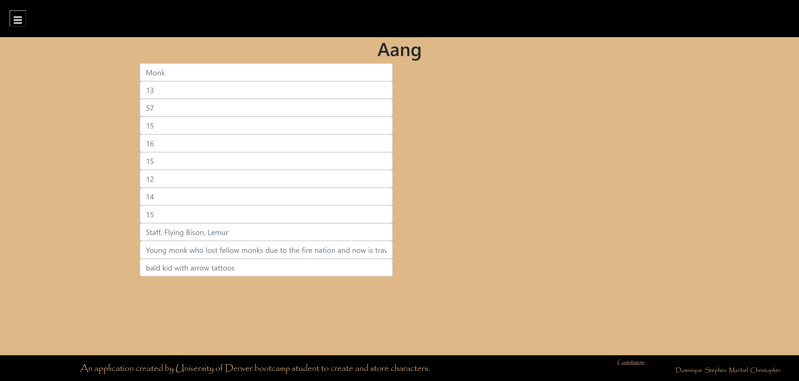

# HallOfHeroes

## Description
Here we have created and application that will allow current and new players of Dungeons and Dragons to store and create new characters for their campaign.

When the user open the application they will land on the home page that will have a brief description on what D&D is. 

From there the user can navigate to the create new character page where the user can create their characters. All characters are stored in the view all characters page and each character will be able to be clicked on to get a full view of that characters character sheet.

## Installations
To install packages run the following command:

npm i

In this project we used:
* axios
* cors
* dotenv
* express
* if-env
* mongodb
* mongoose
* @auth0/auth0-react
* bootstrap
* react-bootstrap
* react-dom
* react-hook-form
* react-icons
* react-router-dom
* react-scripts
* sass

## Screenshots

## Contributors
Dominique Horinka (https://github.com/domihorinka)  
Stephen Pacyga (https://github.com/AlbertTundy) 
Maribel Rivera (https://github.com/mrivera0014/) 
Christopher Watkins (https://github.com/Tevvels)

## Questions
If you have any questions contact any of the contributors listed above.

## Link 

[Link to deployed application](https://hall-of-heroes.herokuapp.com/)